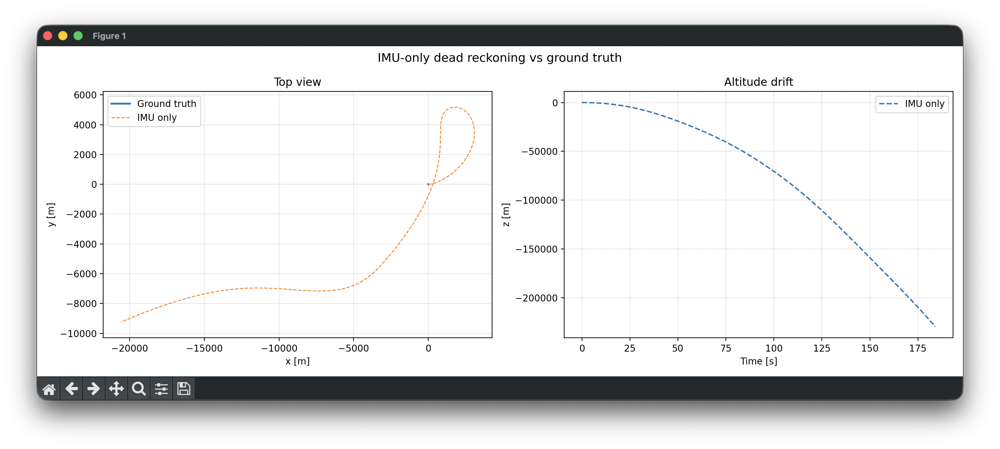
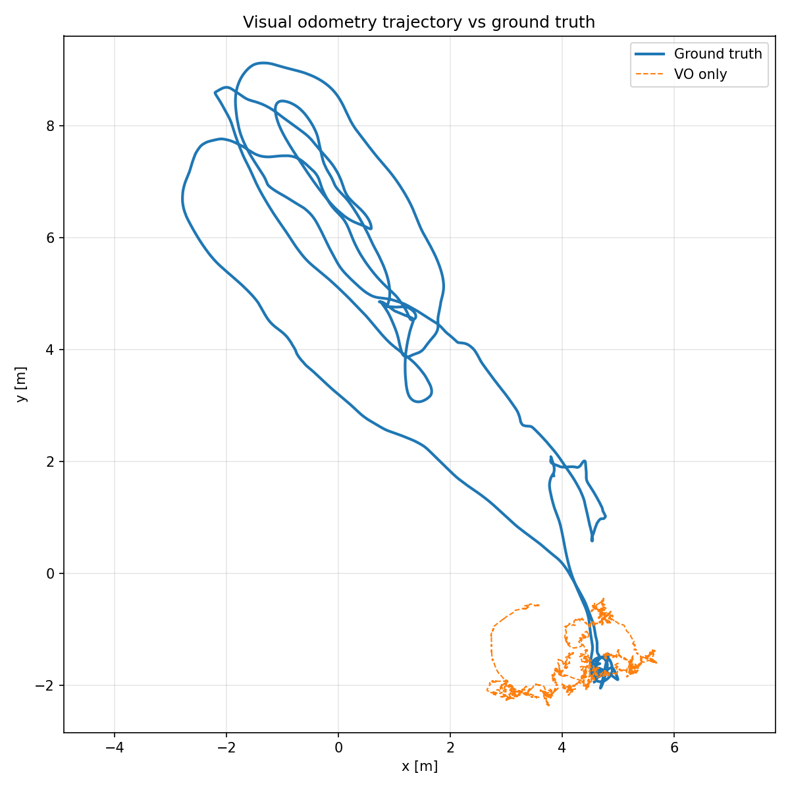
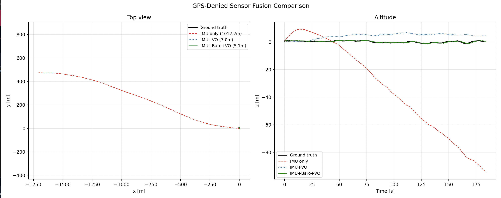
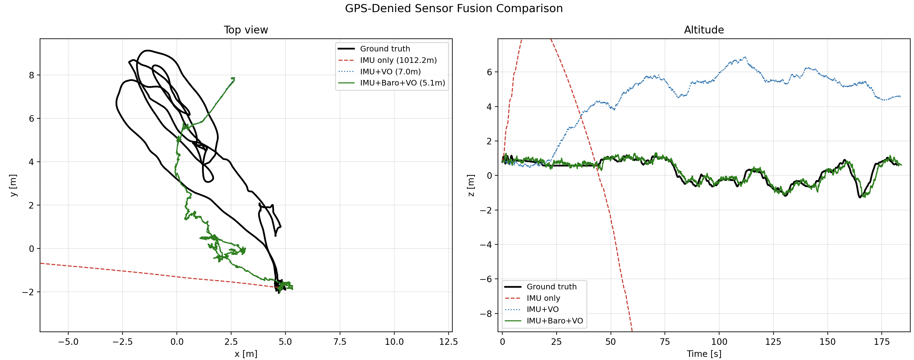

# Camera-IMU Localization

## Motivation: 
IMU drift for a drone in a 3D environment will add up very quickly. Within minutes, the error is in the order of multiple kilometers. 

With camera frames, we don't really have absolute scale to work with. Also, in case there is only pure rotation or very small translation, the computation of the essential matrix doesn't work very well (degeneration)

## Project goal

Use state estimation methods for fusing visual odometry with IMU

## Method

Loosely-coupled monocular visual-inertial odometry using an Error-State Kalman Filter.

- **Vision (Python):** feature tracking → relative pose estimation → `poses.csv`
- **Filter (C++):** IMU propagation + VO update → `trajectory.csv`
- **Visualization (Python):** trajectory vs. ground truth

## Results

As we can see, IMU + VO improves the estimate considerably, but there is a constant drift in the z position. The z position can be improved by using a simulated barometric sensor. However, this does not improve the accuracy of the XY estimates compared to IMU + VO due to the innovation step for the z position update only corresponding to the coordinates of the drone in world coordinates.

Tested on the [EuRoC MAV dataset](https://projects.asl.ethz.ch/datasets/euroc-mav/) (MH_01_easy).
