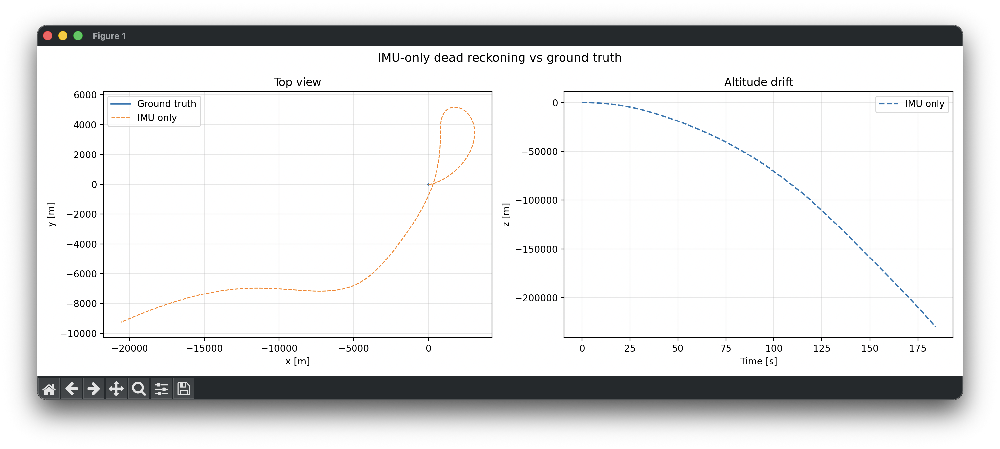
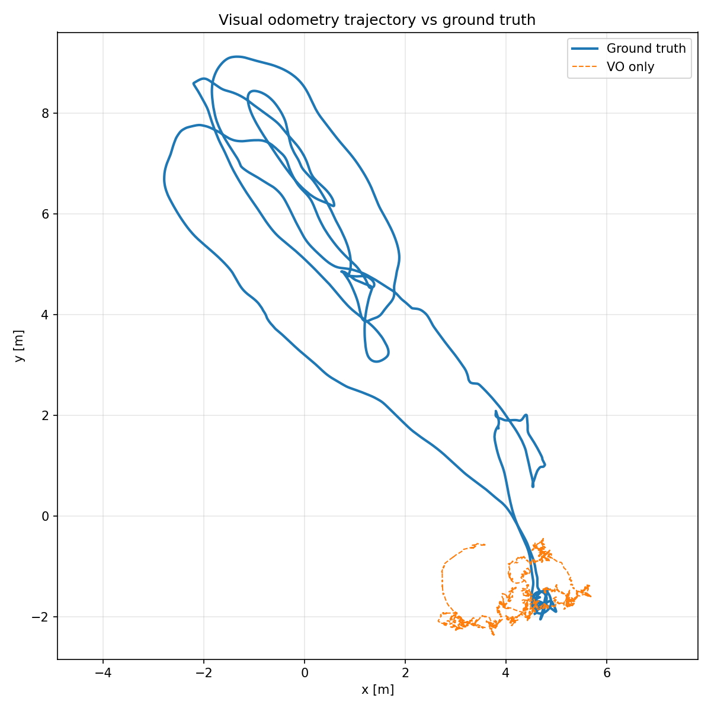
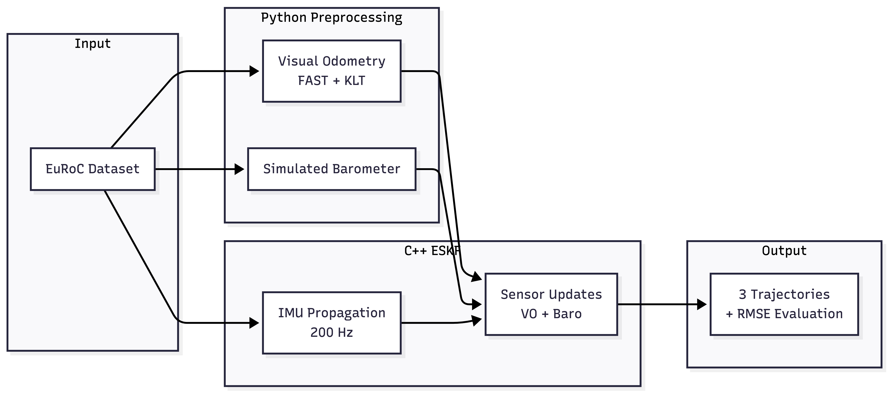
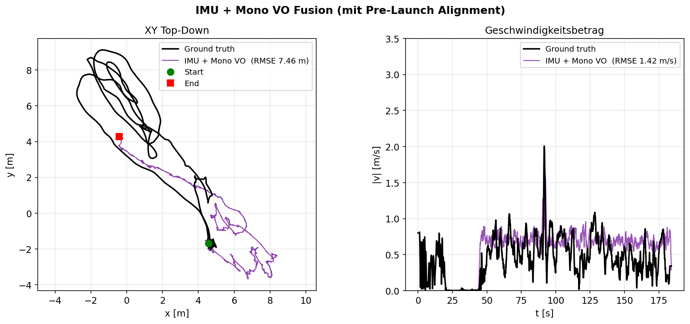
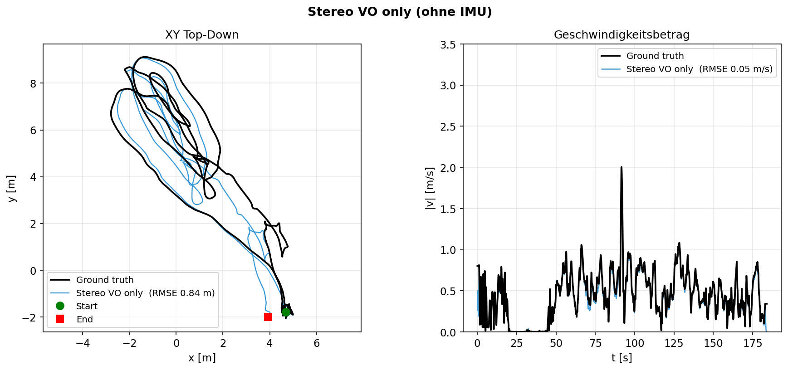
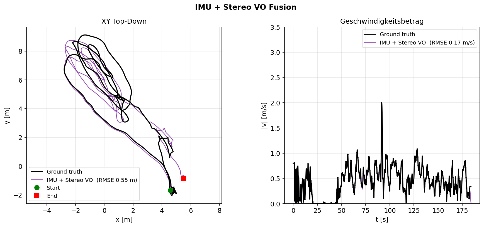

# Camera-IMU Localization

## Motivation: 
IMU drift for a drone in a 3D environment will add up very quickly. Within minutes, the error is in the order of multiple kilometers. 

With camera frames, we don't really have absolute scale to work with. Also, in case there is only pure rotation or very small translation, the computation of the essential matrix doesn't work very well (degeneration)

## Project goal

Use state estimation methods for fusing visual odometry with IMU

## Method

Loosely-coupled visual-inertial odometry using an **Error-State Kalman Filter (ESKF)**. Supports both monocular and stereo VO modes.

- **Vision (Python):** feature tracking → relative pose estimation → `poses.csv`
  - *Mono:* FAST + KLT → essential matrix → unit translation direction
  - *Stereo:* ORB stereo matching → triangulation → PnP → metric translation
- **Filter (C++):** pre-launch bias alignment → IMU propagation → VO update → `trajectory.csv`
- **Visualization (Python):** trajectory vs. ground truth, RMSE

## Results

Tested on the [EuRoC MAV dataset](https://projects.asl.ethz.ch/datasets/euroc-mav/) (MH_01_easy).

### IMU Only

Position error grows rapidly due to double integration of accelerometer noise and bias. Error reaches hundreds of meters over a ~100 s sequence.

### Mono VO Only

Recovers the shape of the trajectory but has **no metric scale** — the translation at each step is a unit vector. Drift accumulates and absolute position is not recoverable without external reference.

### IMU + Mono VO

The ESKF fuses IMU propagation with monocular VO updates. The filter corrects IMU drift while VO provides relative heading.

Some z-drift remains since monocular VO gives no altitude information.

### Stereo VO + IMU

Stereo triangulation gives **metric scale** directly, so VO translation is in meters. This makes the update much more informative for the filter.

Fusing IMU with stereo VO gives a **position RMSE of 0.55 m** over the full sequence. Stereo VO alone achieves 0.84 m — the IMU smooths velocity estimates during fast motion and reduces short-term jitter.
